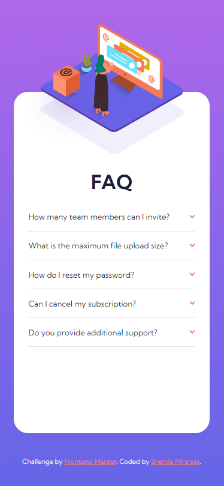

# Frontend Mentor - FAQ accordion card solution

This is a solution to the [FAQ accordion card challenge on Frontend Mentor](https://www.frontendmentor.io/challenges/faq-accordion-card-XlyjD0Oam). Frontend Mentor challenges help you improve your coding skills by building realistic projects. 

## Table of contents

- [Overview](#overview)
  - [The challenge](#the-challenge)
  - [Screenshot](#screenshot)
  - [Links](#links)
- [My process](#my-process)
  - [Built with](#built-with)
  - [Thoughts](#thoughts)
  - [Useful resources](#useful-resources)
- [Author](#author)
- [Acknowledgments](#acknowledgments)

## Overview

### The challenge

Users should be able to:

- View the optimal layout for the component depending on their device's screen size
- See hover states for all interactive elements on the page
- Hide/Show the answer to a question when the question is clicked

### Screenshot



### Links

- Solution URL: [github.com/bmirandach/faq-accordion-card/](https://github.com/bmirandach/faq-accordion-card/)
- Live Site URL: [bmirandach.github.io/faq-accordion-card](https://bmirandach.github.io/faq-accordion-card/)

## My process

### Built with

- Semantic HTML5 markup
- CSS custom properties
- Flexbox
- Mobile-first workflow

### Thoughts

When I first saw this challenge I thought 'ha! This is where the details tag comes in handy'.... haha.I spent a good amount of time trying to replace the marker with the icon provided here. So... I had seen some tabs on codepen made with input and went there looking for pens to guide me. The result was really pretty :)

Of course once you clicked a label the content won't hide until you select another input with the same name. To hide the input I used a class to make them disappear from the screen but not for screen readers (In the code below is called input).

I decided to use the picture tag for the illustration but changed my mind while coding, the things that made me change it for a div with a background image were:
- the lack of the image would not affect the content of the page
- I couldn't think of an alt text to write for that...

CSS classes... I read about how to properly name classes but when I had to do it... it's not so easy then, huh? I was trying to make reusable classes then decided against it. Why do I want a class with flex-direction: row and justify-content: space-between in this project if it will only be used for the elements of the accordion? There's already a class for that so why not add it? 'just do the thing for this project'

I wrote display: flex so many times! Still not confident with using it but I'm so happy it worked~

A piece of the accordion :

```html
<input type="radio" class="input" id="id-input">
  <label class="question" for="id-input">the clickable label~</label>
  <div class="answer">
    <p>The thing that will be hidden 👀.</p>
  </div>
```
```css
.answer {
  height: 0;
  overflow: hidden;
}

.input:checked ~ .answer {
  height: auto;
}

.input {
  position: absolute;
  height: 1px; 
  width: 1px; 
  border: 0;
  margin: -1px;
  padding: 0;
  overflow: hidden;
  clip: rect(1px 1px 1px 1px); /* IE6, IE7 */
  clip: rect(1px, 1px, 1px, 1px);
}
```


### Useful resources

- [Flexbox guide](https://css-tricks.com/snippets/css/a-guide-to-flexbox/) - Second time using flexbox so I was checking this every 2 minutes to make sure things were really like that :) 

## Author

- Github - [Brenda Miranda](https://github.com/bmirandach/)
- Frontend Mentor - [@bmirandach](https://www.frontendmentor.io/profile/bmirandach)

## Acknowledgments

Looking for a way to make an accordion without the details tag I found [Ali Majid's codepen](https://codepen.io/Ali-Majed/pen/JjWMRqv). I incorporated the rotate animation to my project because of that! 🎉
